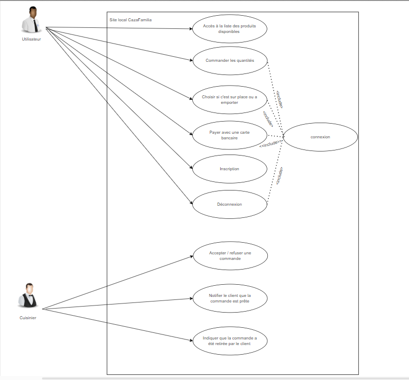

# Documentation - Projet CasaFamilia

Ce document centralise toutes les informations nécessaires concernant la documentation du projet CasaFamilia. Chaque section fait référence aux fichiers ou dossiers pertinents dans le répertoire `conception` ou ailleurs dans le dépôt. 

---

## Table des matières
- [Documents de conception](#documents-de-conception)
  - [Diagramme des cas d'utilisation](#diagramme-des-cas-dutilisation)
  - [Modèle conceptuel des données (MCD)](#modèle-conceptuel-des-données-mcd)
  - [Modèle logique des données (MLD)](#modèle-logique-des-données-mld)
  - [Modèle physique des données (MPD)](#modèle-physique-des-données-mpd)
  - [États des commandes et types de consommation](#états-des-commandes-et-types-de-consommation)
  - [Sitemap](#sitemap)
  - [Maquettes de l'IHM](#maquettes-de-lihm)
  - [Maquette JSON et messages d'erreur](#maquette-json-et-messages-derreur)
- [Documents de réalisation](#documents-de-réalisation)
  - [Manuel d'installation](#manuel-dinstallation)
  - [Jeu de test](#jeu-de-test)
- [Documents d'exploitation](#documents-dexploitation)
  - [Manuel d'utilisation](#manuel-dutilisation)
  - [Documentation API](#documentation-api)

---

## Documents de conception

### Diagramme des cas d'utilisation
Le diagramme des cas d'utilisation décrit les principaux scénarios d'interaction entre les utilisateurs (clients, restaurateurs) et le système CasaFamilia.



---

### Modèle conceptuel des données (MCD)
Le modèle conceptuel des données présente les entités et leurs relations. Il est disponible sous forme d'image dans le répertoire suivant :

[Modèle conceptuel des données](conception/bdd/mcd_db.jpg)

---

### Modèle logique des données (MLD)
Le modèle logique des données traduit le MCD en tables et relations SQL. Il est disponible dans le même répertoire que le MCD :

[Modèle logique des données](conception/bdd/mld_db.jpg)

---

### Modèle physique des données (MPD)
Le modèle physique est implémenté à travers des scripts SQL. Ceux-ci contiennent les définitions des tables, triggers et données initiales :

- [Script SQL principal](conception/bdd/caza_familia.sql)

---

### États des commandes et types de consommation

#### États des commandes :
| **État**         | **Description**               |
|-------------------|-------------------------------|
| En cours          | Commande en attente de validation |
| Refusée           | Commande annulée par le restaurateur |
| Validée           | Commande approuvée et en cours de préparation |

#### Types de consommation :
| **Type**         | **Description**               |
|-------------------|-------------------------------|
| Sur place         | Consommation dans le restaurant |
| À emporter        | Commande retirée par le client |

Les informations sur ces états et types sont disponibles dans la table `commande` du MLD.

---

### Sitemap

#### Version Web :
[Sitemap pour l'application Web](conception/IHM%20WEB/sitemap%20restoweb.pdf)

#### Version Swing :
[Sitemap pour l'application Swing](conception/IHM%20Swing/sitemap%20swing.pdf)

---

### Maquettes de l'IHM

#### Interface Swing :
[Maquettes pour l'application Swing](conception/IHM%20Swing/)

#### Interface Web :
[Maquettes pour l'application Web](conception/IHM%20WEB/)

---

### Maquette JSON et messages d'erreur

#### Fichier JSON principal :
[Commande JSON](CasaFamillia/commandes.json)

Exemple de structure JSON :
```json
{
  "commandeId": "Identifiant unique de la commande",
  "produits": ["Liste des produits commandés"],
  "etat": "État actuel de la commande"
}
```

#### Messages d'erreur possibles :
| **Code HTTP** | **Message**                     | **Description**                           |
|---------------|---------------------------------|-------------------------------------------|
| 400           | "Paramètre manquant"           | Un champ obligatoire est absent.          |
| 500           | "Erreur interne du serveur"    | Une erreur inattendue côté serveur.       |

---

## Documents de réalisation

### Manuel d'installation
1. Clonez le dépôt :
   ```bash
   git clone https://github.com/B-R-3/CazaFamilia.git
   ```
2. Naviguez dans le répertoire principal :
   ```bash
   cd CazaFamilia
   ```
3. Importez le script SQL dans votre base de données :
   ```sql
   SOURCE conception/bdd/caza_familia.sql;
   ```
4. Lancez l'application via le serveur web local ou Swing.

---

### Jeu de test
1. Utilisateurs pré-configurés :
   | **Utilisateur** | **Mot de passe** |
   |------------------|------------------|
   | admin            | admin           |


2. Données existantes :
   - Produits de test : disponibles dans le script SQL.
   - Commandes de test : disponibles via l'interface API.

---

## Documents d'exploitation

### Manuel d'utilisation

#### Inscription
1. Créez un nom d'utilisateur unique.
2. Saisissez un mot de passe sécurisé.
3. Fournissez une adresse email valide.

#### Connexion
1. Entrez votre nom d'utilisateur et mot de passe.
2. Accédez au site si les informations sont validées.

#### Commande
1. Sélectionnez les produits désirés.
2. Indiquez si la commande est à emporter ou sur place.
3. Cliquez sur "Valider".

#### Paiement
1. Confirmez la commande.
2. Suivez les étapes de paiement sécurisé.

---

### Documentation API
1. **Endpoint création de commande :** `/api/commande`
   - **Méthode :** POST
   - **Corps JSON :**
     ```json
     {
       "produits": ["produit1", "produit2"],
       "type": "sur place"
     }
     ```
2. **Endpoint validation par le restaurateur :** `/api/commande/valider`
   - **Méthode :** PUT
   - **Réponse :**
     ```json
     {
       "etat": "validée"
     }
     
